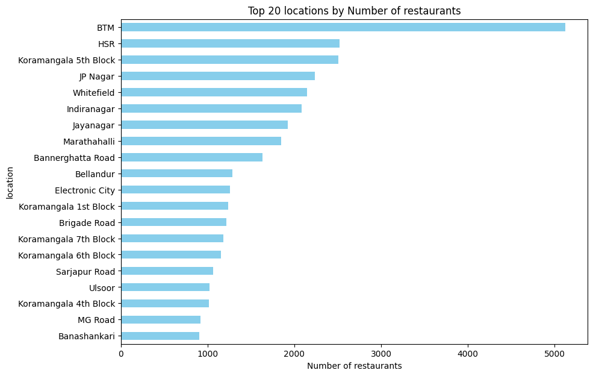

# 🍽️ Zomato Bangalore Restaurants - Exploratory Data Analysis

A comprehensive analysis of Bangalore's restaurant landscape using Zomato data, uncovering fascinating insights about food preferences, pricing patterns, and dining trends in India's Silicon Valley.

## 📊 Dataset Overview

The dataset contains **51,717 restaurants** across Bangalore with 17 features including:
- Restaurant details (name, location, cuisine types)
- Service offerings (online ordering, table booking)
- Customer feedback (ratings, votes, dish preferences)
- Pricing information (cost for two people)
- Restaurant categorization (type, listing category)

## 🔍 Key Insights & Discoveries

### 🏆 Cuisine Preferences: The Battle of Flavors
**North Indian cuisine dominates Bangalore's food scene**, followed closely by Chinese and South Indian cuisines. This raises an interesting question: Are Bangaloreans genuinely preferring North Indian dishes, or does this reflect the city's diverse population with significant North Indian residents?

**Top 5 Most Popular Cuisines:**
1. North Indian
2. Chinese  
3. South Indian
4. Fast Food
5. Biryani

### 💰 Pricing Patterns & Economic Insights
- **Sweet spot pricing**: Most restaurants (majority) charge between ₹300-600 for two people
- **Higher cost = Higher ratings**: There's a clear positive correlation between restaurant prices and customer ratings
- **Premium dining**: Expensive restaurants are less likely to offer online ordering, focusing on in-person experiences

### 📱 Digital Transformation in Food Service
- **60% of restaurants** offer online ordering - showing Bangalore's digital adoption

- **Only 12% offer table booking** - a significant opportunity for service enhancement

- **64% more customer engagement** for restaurants with online ordering (higher vote counts)

### ⭐ Rating Dynamics & Customer Behavior
- **Average rating**: 3.6/5 across all restaurants

- **Popular = Highly Rated**: Strong correlation between vote counts and ratings

- **Potential rating inflation**: Restaurants with <10 votes but >4.0 ratings might have inflated scores
- **Dish information advantage**: Restaurants with "dish_liked" data average 3.9 rating vs 3.4 without

### 🏙️ Geographic Distribution & Hotspots
**BTM (Byrasandra, Tavarekere, Madiwala)** leads as the restaurant hub of Bangalore.

**Nightlife Capitals:**
- **Indiranagar** - Highest concentration of pubs and bars
- **Koramangala** - Second-highest nightlife destination  
- **MG Road** - Traditional entertainment district

### 🍕 Restaurant Types & Consumer Preferences
**"Quick Bites"** emerges as the most popular restaurant type, reflecting Bangalore's fast-paced lifestyle and preference for convenient dining options.

**Service Type Distribution:**
- Delivery: 25,000+ restaurants
- Pubs and Bars: 697 establishments

### 🏢 Brand Dominance & Market Leaders
**Cafe Coffee Day** rules the roost with **96 outlets** across Bangalore, showcasing the power of consistent branding and strategic location placement.

### 🍛 Most Loved Dishes
Based on customer preferences, popular dishes include a mix of:
- Traditional Indian favorites
- Indo-Chinese fusion items
- Quick bite options
- Regional specialties

### 🤝 Cuisine Pairing Trends
**Chinese + North Indian** is the most common cuisine combination, reflecting Bangalore's love for fusion dining and diverse taste preferences.

## 📈 Business Intelligence Takeaways

### For Restaurant Owners:
1. **Location Strategy**: Consider BTM area for high restaurant density benefits
2. **Service Integration**: Online ordering significantly boosts customer engagement
3. **Pricing Psychology**: Higher prices often correlate with better perceived quality
4. **Niche Opportunities**: Table booking services are underutilized (only 12% adoption)

### For Food Entrepreneurs:
1. **Market Gaps**: Premium table booking services have growth potential
2. **Cuisine Strategy**: North Indian-Chinese fusion shows proven market demand
3. **Digital First**: Online presence is crucial for customer engagement
4. **Quick Service**: "Quick Bites" format aligns with consumer preferences

### For Customers:
1. **Rating Reliability**: Be cautious of high ratings with very few votes
2. **Value Discovery**: Mid-range pricing (₹300-600) offers best variety
3. **Location Insights**: BTM area offers maximum dining options
4. **Nightlife Planning**: Indiranagar and Koramangala for best pub/bar experiences

## 🛠️ Technical Implementation

### Data Preprocessing Steps:
- Cleaned pricing data (removed commas, converted to float)
- Standardized rating format (converted from "X/5" to numeric)
- Handled missing values strategically
- Created feature engineering for "has_dish_liked" binary indicator
- Processed multi-value fields (cuisines, restaurant types)

### Analysis Techniques Used:
- Distribution analysis for pricing and ratings
- Correlation analysis for cost vs. rating relationships  
- Geographic clustering for location-based insights
- Co-occurrence analysis for cuisine combinations
- Text analysis for popular dishes
- Categorical analysis for service offerings

## 📊 Visualizations Included:
- Cuisine popularity bar charts
- Cost vs. Rating scatter plots with service overlays
- Geographic distribution maps
- Service adoption pie charts
- Brand dominance rankings
- Cuisine co-occurrence networks
- Popular dishes word clouds

## 🎯 Future Research Directions:
1. **Sentiment Analysis**: Deep dive into review text for emotional insights
2. **Temporal Analysis**: Study rating and preference changes over time
3. **Competitive Analysis**: Market share and positioning studies
4. **Customer Segmentation**: Behavioral clustering based on preferences
5. **Predictive Modeling**: Rating prediction based on restaurant features

---

*This analysis provides a comprehensive view of Bangalore's dynamic food scene, offering valuable insights for stakeholders across the restaurant ecosystem. The data reveals not just what people eat, but how they choose where to eat and what drives their dining decisions in one of India's most cosmopolitan cities.*

## 🔗 Dataset Source
Data sourced from Kaggle: "Zomato Bangalore Restaurants" by Himanshu Poddar
[Dataset link](https://www.kaggle.com/datasets/himanshupoddar/zomato-bangalore-restaurants)

---
**Happy Analyzing! 🎉**
